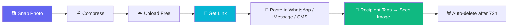

<p align="center">
  <a href="https://github.com/tgollogly/AnywhereMMS">
    
  </a>
</p>

<h1 align="center">📸 AnywhereMMS</h1>

<p align="center">
  <strong>Snap a photo → get a link → paste it in any chat. Done.</strong><br/>
  Free photo sharing for ordinary phone users — no app, no signup, no hassle.
</p>

<p align="center">
  
  
  
  
  
</p>

---

## 👋 For non-technical users (start here)

**You do not need to install anything or run any commands.** If someone has put AnywhereMMS online for you, here's all you do:

### On your phone (4 steps)

| Step | What to do |
|------|------------|
| **1** | Open the AnywhereMMS **website link** you were given (in Safari or Chrome) |
| **2** | Tap **Take Photo** or **Choose from Gallery** |
| **3** | Tap **Create Share Link** |
| **4** | Tap **Share via Phone** → pick WhatsApp, Messages, or SMS |

That's it. The person you send it to **taps the link** and sees your photo. No app, no signup.

📖 **Full guide with pictures:** open `/how-to.html` on the site (e.g. `https://yoursite.com/how-to.html`)

### Bookmark it on your phone

- **iPhone:** Tap Share → **Add to Home Screen** — works like an app
- **Android:** Tap ⋮ menu → **Add to Home screen**

### Important note for the person hosting this

Non-technical users need a **live website URL** — they cannot run `npm start` themselves. Deploy once (Render, Railway, Fly.io, etc.) and share that link with everyone.

---

**You don't need to set up SMS APIs or install anything.** AnywhereMMS is built for real people with normal phones:

| Problem today | How AnywhereMMS helps |
|---------------|----------------------|
| 📷 Photos are huge and eat mobile data | Auto-compresses before upload — saves up to **80% data** |
| 💬 Sending big pics in WhatsApp/iMessage is slow | Get a **tiny link** instead of a 5 MB attachment |
| 🔗 Google Drive / Dropbox links need login | Recipient **taps once** — no account, no app |
| 📵 MMS doesn't work across all carriers | Works on **any phone** with a browser |
| 🔒 You want privacy | Links **expire in 72 hours** — not stored forever |

### 4 taps on your phone

```
1. Open AnywhereMMS in your browser
2. Snap or upload a photo
3. Tap "Create Share Link"
4. Paste the link in WhatsApp, iMessage, SMS, or email
```

The recipient taps the link and **sees your photo instantly** — with a preview thumbnail in WhatsApp and iMessage.

> **This is the easiest way.** You paste the link yourself using whatever app you already use. No server SMS setup required.

<details>
<summary><strong>📲 Optional: auto-send SMS from the server</strong></summary>

If you're running your own instance with TextBelt or Twilio configured, the app can text the link for you. But for most people, **copy-paste the link** — it's simpler and works everywhere.
</details>

---

## 🌟 Overview

**AnywhereMMS** compresses your photo, hosts it temporarily on a free server, and gives you a **direct no-follow preview link** you can paste anywhere:

- **WhatsApp** — shows image preview in chat
- **iMessage** — rich link preview with thumbnail
- **SMS** — recipient taps the URL
- **Email / Messenger / Slack** — works everywhere

| | |
|---|---|
| 📱 **For senders** | Snap → Get Link → Paste in your chat app |
| 👀 **For recipients** | Tap link → See full image in browser |
| 🔒 **Privacy** | Auto-expiring links, no tracking cookies |
| 💸 **Cost** | Free & open-source (MIT) |

---

## ✨ Features

| Feature | Description |
|---------|-------------|
| 🔗 **Direct Share Links** | Primary flow — copy & paste, no SMS API needed |
| 📷 **Camera Capture** | Works in mobile browsers + file upload fallback |
| 🗜️ **Dual Compression** | Client + server compression saves mobile data |
| 👁️ **Link Previews** | Open Graph tags for WhatsApp/iMessage thumbnails |
| 💬 **Auto-SMS (optional)** | TextBelt / Twilio for hands-free sending |
| 🔐 **Private & Expiring** | UUID links, 72h TTL, view limits |
| 🍪 **Cookie Consent** | No tracking — preference stored locally only |
| 📋 **Legal Pages** | Privacy, Cookie, and Terms pages included |

---

## 🔄 How It Works



---

## 🚀 Quick Start

### For users (just want to share photos)

1. Open the site on your phone browser
2. Allow camera access (or upload from gallery)
3. Tap **Create Share Link**
4. Tap **Share via Phone** or **Copy**
5. Paste into WhatsApp, iMessage, or wherever you chat

### Deploy live on Render (free — share a link with everyone)

[](https://render.com/deploy?repo=https://github.com/tgollogly/AnywhereMMS)

1. Click the button above → sign in to Render → deploy (~2 min)
2. Open your `https://anywheremms-xxxx.onrender.com` URL
3. Share it — non-technical users just open the link on their phone

📖 Full guide: [docs/DEPLOY_RENDER.md](docs/DEPLOY_RENDER.md) — free tier limits, commercial use, scaling

**Render free tier is fine for personal/family use.** Heavy commercial traffic needs a paid plan (~$7+/mo) — see the deploy guide.

### For developers (local)

```bash
git clone https://github.com/tgollogly/AnywhereMMS.git
cd AnywhereMMS
npm install
cp .env.example .env
npm start
```

Open **http://localhost:3000** — link sharing works immediately. SMS is optional.

### Environment Variables

| Variable | Default | Description |
|----------|---------|-------------|
| `PORT` | `3000` | Server port |
| `BASE_URL` | `http://localhost:3000` | Public URL (used in share links) |
| `IMAGE_TTL_HOURS` | `72` | Hours before images expire |
| `MAX_VIEWS` | `10` | Max views per image |
| `SMS_PROVIDER` | `console` | Only needed for auto-SMS: `textbelt` or `twilio` |

> **Important:** Set `BASE_URL` to your public domain in production so share links work on phones.

---

## 📁 Project Structure

```
AnywhereMMS/
├── docs/hero.jpg         # README hero banner
├── server/               # Express API (share + optional SMS)
├── public/               # Mobile-friendly web UI
│   ├── index.html        # Snap → Share Link flow
│   └── js/app.js         # Camera, compress, copy, native share
├── LICENSE               # MIT + disclaimer
└── README.md
```

---

## 🔐 Privacy & Legal

- **Privacy Policy:** `/privacy.html`
- **Cookie Policy:** `/cookies.html` — no tracking cookies
- **Terms of Use:** `/terms.html`

Photos are compressed, stored temporarily, and **automatically deleted**. Phone numbers are **not stored** when you use the link-sharing flow.

---

## ⚠️ Disclaimer

> **AnywhereMMS is provided "AS IS" without warranty.**

- Only share images you have the right to share, with recipient consent.
- Links expire automatically — not intended for permanent storage.
- Copyright © 2026 **tgollogly** — MIT licensed. See [LICENSE](LICENSE).

---

<p align="center">
  Made with ❤️ by <a href="https://github.com/tgollogly">tgollogly</a><br/>
  <sub>Snap it. Link it. Share it anywhere.</sub>
</p>
