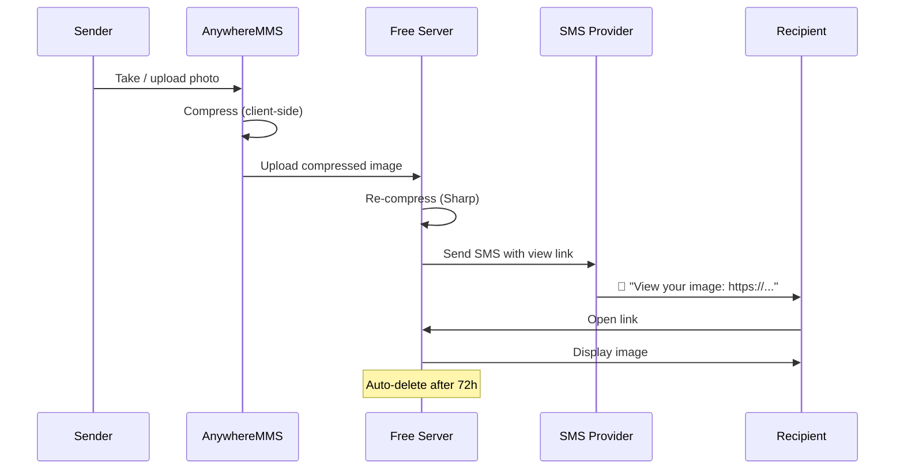

<p align="center">
  
</p>

<h1 align="center">📸 AnywhereMMS</h1>

<p align="center">
  <strong>Take a photo. Compress it. Text a link. Done.</strong><br/>
  Free, privacy-first photo sharing via SMS — no app required.
</p>

<p align="center">
  
  
  
  
  
</p>

---

## 🌟 Overview

**AnywhereMMS** lets anyone capture or upload a photo, automatically compress it to save mobile data, upload it to a free self-hosted server, and send the recipient an **SMS with a private view link** — no follow-up required, no app to install.

| | |
|---|---|
| 📱 **For senders** | Open camera → snap → enter phone → send |
| 📩 **For recipients** | Tap SMS link → view image instantly |
| 🔒 **Privacy** | Auto-expiring links, no tracking cookies |
| 💸 **Cost** | Free & open-source (MIT) |

---

## ✨ Features

| Feature | Description |
|---------|-------------|
| 📷 **Camera Capture** | Native browser camera API with file upload fallback |
| 🗜️ **Dual Compression** | Client-side canvas + server-side Sharp (JPEG ~72 quality) |
| 📤 **Free Hosting** | Self-hosted temporary storage with auto-cleanup |
| 💬 **SMS Delivery** | TextBelt (free tier), Twilio, or console mode for dev |
| 🔗 **Private Links** | UUID-based URLs with expiry & view limits |
| 🍪 **Cookie Consent** | GDPR-friendly banner — no tracking cookies |
| 📋 **Legal Pages** | Privacy Policy, Cookie Policy, Terms of Use |
| ⚡ **Rate Limited** | Abuse protection built-in |

---

## 🔄 How It Works



---

## 🚀 Quick Start

### Prerequisites

- **Node.js** 18 or later
- An SMS provider key (optional — `console` mode logs to terminal)

### Installation

```bash
git clone https://github.com/tgollogly/AnywhereMMS.git
cd AnywhereMMS
npm install
cp .env.example .env
npm start
```

Open **http://localhost:3000** in your browser.

### Environment Variables

| Variable | Default | Description |
|----------|---------|-------------|
| `PORT` | `3000` | Server port |
| `BASE_URL` | `http://localhost:3000` | Public URL for SMS links |
| `IMAGE_TTL_HOURS` | `72` | Hours before images expire |
| `MAX_VIEWS` | `10` | Max views per image |
| `SMS_PROVIDER` | `console` | `console`, `textbelt`, or `twilio` |
| `TEXTBELT_KEY` | `textbelt` | TextBelt API key (free: 1 SMS/day) |
| `MAX_SENDS_PER_HOUR` | `5` | Rate limit per IP |

### SMS Providers

<details>
<summary><strong>🆓 TextBelt (Free Tier)</strong></summary>

Set in `.env`:

```env
SMS_PROVIDER=textbelt
TEXTBELT_KEY=textbelt
```

Free tier: 1 SMS/day to US numbers. See [textbelt.com](https://textbelt.com).
</details>

<details>
<summary><strong>📞 Twilio</strong></summary>

```env
SMS_PROVIDER=twilio
TWILIO_ACCOUNT_SID=your_sid
TWILIO_AUTH_TOKEN=your_token
TWILIO_FROM_NUMBER=+1234567890
```
</details>

<details>
<summary><strong>🖥️ Console (Development)</strong></summary>

```env
SMS_PROVIDER=console
```

SMS content is printed to the server log — perfect for local testing.
</details>

---

## 📁 Project Structure

```
AnywhereMMS/
├── server/
│   ├── index.js          # Express app entry
│   ├── config.js         # Environment config
│   ├── store.js          # Image metadata & cleanup
│   ├── sms.js            # SMS provider abstraction
│   └── routes/api.js     # Upload, send, view APIs
├── public/
│   ├── index.html        # Send page (camera + form)
│   ├── view.html         # Recipient view page
│   ├── privacy.html      # Privacy Policy
│   ├── cookies.html      # Cookie Policy
│   ├── terms.html        # Terms of Use
│   ├── css/styles.css    # Design system
│   └── js/               # Client logic
├── docs/
│   └── banner.svg        # README banner graphic
├── LICENSE               # MIT + disclaimer
└── .env.example
```

---

## 🔐 Privacy & Legal

> **Your photos, your control.** Images are compressed, stored temporarily, and automatically deleted.

- **Privacy Policy:** [/privacy.html](public/privacy.html) or hosted at `/privacy.html`
- **Cookie Policy:** [/cookies.html](public/cookies.html)
- **Terms of Use:** [/terms.html](public/terms.html)

### Cookie Notice

On first visit, users see a cookie consent banner. We only store a local preference — **no tracking, no analytics, no ads**.

### Data Retention

| Data | Retention |
|------|-----------|
| Uploaded images | 72 hours (configurable) |
| Phone numbers | Not stored after SMS send |
| Server logs | Up to 30 days |
| Cookie preference | Until browser storage cleared |

---

## ⚠️ Disclaimer

> **AnywhereMMS is provided "AS IS" without warranty.**

- You are responsible for obtaining **recipient consent** before sending SMS messages.
- Standard **carrier SMS rates** may apply.
- SMS delivery depends on **third-party providers** — delivery is not guaranteed.
- Do not use for **illegal, harmful, or abusive** content.
- The author (**tgollogly**) retains copyright; MIT license allows free use, modification, and distribution with attribution.

See [LICENSE](LICENSE) for full terms.

---

## 🎨 Design

Built with a modern dark theme:

| Color | Hex | Usage |
|-------|-----|-------|
| Primary | `#6366f1` | Buttons, accents |
| Accent | `#06b6d4` | Links, highlights |
| Success | `#10b981` | Compression savings |
| Background | `#0f172a` | Page background |
| Card | `#1e293b` | Content cards |

---

## 🤝 Contributing

Contributions welcome! Please open an issue or PR on GitHub.

1. Fork the repo
2. Create a feature branch (`git checkout -b feature/amazing-feature`)
3. Commit changes (`git commit -m 'Add amazing feature'`)
4. Push (`git push origin feature/amazing-feature`)
5. Open a Pull Request

---

## 📄 License

```
MIT License — Copyright (c) 2026 tgollogly
```

This is **original code by tgollogly**, released under the [MIT License](LICENSE). You may use, modify, and distribute it freely with attribution.

---

<p align="center">
  Made with ❤️ by <a href="https://github.com/tgollogly">tgollogly</a><br/>
  <sub>Send photos anywhere. No app. No hassle.</sub>
</p>
